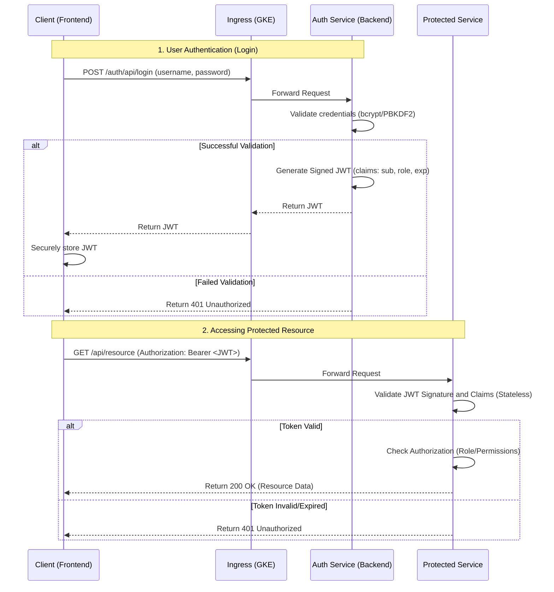

# Authentication Microservice Implementation Guide
## GKE Shop Microservices Demo Enhancement

This comprehensive guide provides step-by-step instructions for integrating a dedicated authentication microservice into the existing [kwamep2025-microservices-demo](https://github.com/puplampuclou/kwamep2025-microservices-demo) repository.

## Table of Contents

1. [Project Overview](#project-overview)
2. [Architecture Diagrams](#architecture-diagrams)
3. [Repository Structure](#repository-structure)
4. [Prerequisites](#prerequisites)
5. [Implementation Phases](#implementation-phases)
6. [File Creation Guide](#file-creation-guide)
7. [Testing & Verification](#testing--verification)
8. [Security Considerations](#security-considerations)

## Project Overview

The objective is to enhance the existing microservices architecture by introducing a centralized authentication service that:
- Manages user authentication, authorization, and profile management
- Uses JWT tokens for stateless, scalable security
- Integrates with GKE Ingress and Google-managed SSL certificates
- Provides a modern web interface for user interactions
- Utilizes the static IP address `104.197.101.180` and subdomain `demoshop.puplampu.me`

## Architecture Diagrams

### System Architecture Overview


### Authentication Flow Sequence



## Repository Structure

The following shows the proposed directory structure with new files marked `(+)` and modified files marked `(M)`:

```
kwamep2025-microservices-demo/
│
├── kubernetes-manifests/
│   (+) ├── auth-service.yaml           # Auth service deployment and service
│   (+) ├── demoshop-ingress.yaml       # New Ingress configuration
│   (+) ├── managed-cert.yaml           # ManagedCertificate resource
│   (M) └── frontend.yaml               # Updated frontend service
│
├── src/
│   (+) ├── auth-service/               # New Authentication service backend
│   │   (+) ├── cmd/
│   │   │   (+) └── main.go             # Application entry point
│   │   (+) ├── internal/
│   │   │   (+) ├── auth/
│   │   │   │   (+) ├── handlers.go     # HTTP handlers
│   │   │   │   (+) ├── middleware.go   # JWT middleware
│   │   │   │   (+) └── service.go      # Business logic
│   │   │   (+) ├── database/
│   │   │   │   (+) ├── connection.go   # Database connection
│   │   │   │   (+) └── migrations.go   # Database schema
│   │   │   (+) └── models/
│   │   │       (+) ├── user.go         # User model
│   │   │       (+) └── token.go        # Token model
│   │   (+) ├── config/
│   │   │   (+) └── config.go           # Configuration management
│   │   (+) ├── Dockerfile              # Container definition
│   │   (+) ├── go.mod                  # Go module definition
│   │   (+) └── go.sum                  # Go module checksums
│   │
│   ├── frontend/                       # Existing frontend service
│   │   ├── public/
│   │   (M) └── index.html              # Modified splash page
│   │   ├── src/
│   │   │   ├── components/
│   │   │   (+) ├── Auth/
│   │   │   │   (+) ├── Login.js
│   │   │   │   (+) ├── PasswordResetRequest.js
│   │   │   │   (+) └── PasswordResetConfirm.js
│   │   │   (+) ├── ProtectedRoute.js   # Route protection component
│   │   (M) ├── App.js                  # Updated routing
│   │   (M) ├── package.json            # Updated dependencies
│   │   (M) └── Dockerfile              # Updated container
│   │
│   └── ... (other existing services)
│
├── scripts/
│   (+) ├── deploy.sh                   # Deployment automation
│   (+) ├── build-images.sh             # Image building script
│   (+) └── setup-infrastructure.sh     # GCP infrastructure setup
│
(M) ├── README.md                       # Updated project documentation
(+) ├── AUTHENTICATION.md               # Authentication service documentation
└── (+) docker-compose.dev.yml         # Local development environment
```

## Prerequisites

Before starting the implementation, ensure you have:

- **Google Cloud Access**: Access to the GCP project hosting the GKE cluster
- **CLI Tools**: 
  - `gcloud` CLI installed and authenticated
  - `kubectl` installed and configured for the target GKE cluster
  - `docker` for building container images
- **Network Setup**: 
  - Reserved Global Static IP address: `104.197.101.180`
  - DNS management access for domain `puplampu.me`
- **Development Tools**:
  - Go 1.21+ (for auth service)
  - Node.js 18+ (for frontend updates)
  - Git for version control

## Implementation Phases

### Phase 1: GKE Infrastructure Setup

#### 1.1 Reserve and Configure Static IP

```bash
# Reserve the global static IP address
gcloud compute addresses create demoshop-static-ip \
  --global \
  --addresses 104.197.101.180

# Verify the reservation
gcloud compute addresses describe demoshop-static-ip --global
```

#### 1.2 Create Infrastructure Manifests

Create the Kubernetes manifests for the new infrastructure components.

#### 1.3 Update DNS Configuration

After deploying the Ingress, update the DNS A record for `demoshop.puplampu.me` to point to `104.197.101.180`.

### Phase 2: Authentication Service Development

#### 2.1 Initialize Go Module

```bash
cd src/auth-service
go mod init auth-service
go get github.com/gin-gonic/gin
go get github.com/golang-jwt/jwt/v5
go get golang.org/x/crypto/bcrypt
go get gorm.io/gorm
go get gorm.io/driver/postgres
```

#### 2.2 Implement Core Components

Develop the authentication service with secure password handling, JWT generation, and password reset functionality.

#### 2.3 Database Setup

Implement user schema with proper security measures including password hashing and secure token management.

### Phase 3: Frontend Integration

#### 3.1 Update Dependencies

```bash
cd src/frontend
npm install react-router-dom@6
npm install axios
npm install js-cookie
```

#### 3.2 Implement Authentication Components

Create login interface, password reset flow, and protected route components.

#### 3.3 Update Routing

Integrate authentication flows into the existing frontend application.

### Phase 4: Deployment and Configuration

#### 4.1 Build and Push Images

```bash
# Build auth service
docker build -t gcr.io/your-project-id/auth-service:v1.0.0 src/auth-service/
docker push gcr.io/your-project-id/auth-service:v1.0.0

# Build updated frontend
docker build -t gcr.io/your-project-id/frontend:v1.1.0 src/frontend/
docker push gcr.io/your-project-id/frontend:v1.1.0
```

#### 4.2 Deploy to GKE

```bash
# Apply infrastructure manifests
kubectl apply -f kubernetes-manifests/managed-cert.yaml
kubectl apply -f kubernetes-manifests/demoshop-ingress.yaml
kubectl apply -f kubernetes-manifests/auth-service.yaml

# Update frontend deployment
kubectl set image deployment/frontend-deployment \
  frontend=gcr.io/your-project-id/frontend:v1.1.0
```

## File Creation Guide

### 1. Kubernetes Manifests

#### `kubernetes-manifests/managed-cert.yaml`

```yaml
apiVersion: networking.gke.io/v1
kind: ManagedCertificate
metadata:
  name: demoshop-managed-cert
spec:
  domains:
    - demoshop.puplampu.me
```

#### `kubernetes-manifests/demoshop-ingress.yaml`

```yaml
apiVersion: networking.k8s.io/v1
kind: Ingress
metadata:
  name: demoshop-ingress
  annotations:
    kubernetes.io/ingress.global-static-ip-name: "demoshop-static-ip"
    networking.gke.io/managed-certificates: "demoshop-managed-cert"
    kubernetes.io/ingress.class: "gce"
spec:
  rules:
    - host: demoshop.puplampu.me
      http:
        paths:
          # Route authentication API calls to the auth-service backend
          - path: /auth/api/*
            pathType: Prefix
            backend:
              service:
                name: auth-service
                port:
                  number: 8080
          # Route all other traffic to the frontend service
          - path: /*
            pathType: Prefix
            backend:
              service:
                name: frontend-service
                port:
                  number: 80
```

#### `kubernetes-manifests/auth-service.yaml`

```yaml
apiVersion: v1
kind: Service
metadata:
  name: auth-service
spec:
  selector:
    app: auth-service
  ports:
    - protocol: TCP
      port: 8080
      targetPort: 8080
---
apiVersion: apps/v1
kind: Deployment
metadata:
  name: auth-service-deployment
spec:
  replicas: 3
  selector:
    matchLabels:
      app: auth-service
  template:
    metadata:
      labels:
        app: auth-service
    spec:
      containers:
        - name: auth-service
          image: gcr.io/your-project-id/auth-service:v1.0.0
          ports:
            - containerPort: 8080
          env:
            - name: PORT
              value: "8080"
            - name: DB_HOST
              value: "postgres-service"
            - name: DB_PORT
              value: "5432"
            - name: DB_NAME
              value: "authdb"
            - name: DB_USER
              valueFrom:
                secretKeyRef:
                  name: db-secret
                  key: username
            - name: DB_PASSWORD
              valueFrom:
                secretKeyRef:
                  name: db-secret
                  key: password
            - name: JWT_SECRET
              valueFrom:
                secretKeyRef:
                  name: jwt-secret
                  key: secret
          livenessProbe:
            httpGet:
              path: /health
              port: 8080
            initialDelaySeconds: 30
            periodSeconds: 10
          readinessProbe:
            httpGet:
              path: /ready
              port: 8080
            initialDelaySeconds: 5
            periodSeconds: 5
```

### 2. Authentication Service Code

#### `src/auth-service/cmd/main.go`

```go
package main

import (
    "log"
    "os"

    "auth-service/internal/auth"
    "auth-service/internal/database"
    "auth-service/config"

    "github.com/gin-gonic/gin"
)

func main() {
    // Load configuration
    cfg := config.Load()

    // Initialize database
    db, err := database.Initialize(cfg.DatabaseURL)
    if err != nil {
        log.Fatal("Failed to connect to database:", err)
    }

    // Run migrations
    if err := database.Migrate(db); err != nil {
        log.Fatal("Failed to run migrations:", err)
    }

    // Initialize router
    router := gin.Default()

    // Setup CORS
    router.Use(func(c *gin.Context) {
        c.Header("Access-Control-Allow-Origin", "*")
        c.Header("Access-Control-Allow-Methods", "GET, POST, PUT, DELETE, OPTIONS")
        c.Header("Access-Control-Allow-Headers", "Origin, Content-Type, Authorization")
        
        if c.Request.Method == "OPTIONS" {
            c.AbortWithStatus(204)
            return
        }
        
        c.Next()
    })

    // Health checks
    router.GET("/health", func(c *gin.Context) {
        c.JSON(200, gin.H{"status": "healthy"})
    })

    router.GET("/ready", func(c *gin.Context) {
        c.JSON(200, gin.H{"status": "ready"})
    })

    // Initialize auth handlers
    authService := auth.NewService(db, cfg.JWTSecret)
    authHandler := auth.NewHandler(authService)

    // Auth routes
    authGroup := router.Group("/auth/api")
    {
        authGroup.POST("/login", authHandler.Login)
        authGroup.POST("/register", authHandler.Register)
        authGroup.POST("/password-reset/request", authHandler.RequestPasswordReset)
        authGroup.POST("/password-reset/confirm", authHandler.ConfirmPasswordReset)
        
        // Admin routes
        adminGroup := authGroup.Group("/admin")
        adminGroup.Use(auth.AdminMiddleware(cfg.JWTSecret))
        {
            adminGroup.POST("/password-reset", authHandler.AdminPasswordReset)
        }
    }

    // Start server
    port := os.Getenv("PORT")
    if port == "" {
        port = "8080"
    }

    log.Printf("Starting server on port %s", port)
    if err := router.Run(":" + port); err != nil {
        log.Fatal("Failed to start server:", err)
    }
}
```

#### `src/auth-service/internal/models/user.go`

```go
package models

import (
    "time"
    "gorm.io/gorm"
    "golang.org/x/crypto/bcrypt"
)

type User struct {
    ID                  uint      `json:"id" gorm:"primaryKey"`
    Username            string    `json:"username" gorm:"uniqueIndex;not null"`
    Email               string    `json:"email" gorm:"uniqueIndex;not null"`
    PasswordHash        string    `json:"-" gorm:"not null"`
    Role                string    `json:"role" gorm:"not null;default:'user'"`
    IsActive            bool      `json:"is_active" gorm:"not null;default:true"`
    CreationTimestamp   time.Time `json:"creation_timestamp" gorm:"autoCreateTime"`
    LastLoginTimestamp  *time.Time `json:"last_login_timestamp"`
    CreatedAt           time.Time `json:"-"`
    UpdatedAt           time.Time `json:"-"`
    DeletedAt           gorm.DeletedAt `json:"-" gorm:"index"`
}

type PasswordResetToken struct {
    ID        uint      `json:"id" gorm:"primaryKey"`
    UserID    uint      `json:"user_id" gorm:"not null"`
    User      User      `json:"-" gorm:"foreignKey:UserID"`
    TokenHash string    `json:"-" gorm:"not null"`
    ExpiresAt time.Time `json:"expires_at" gorm:"not null"`
    Used      bool      `json:"used" gorm:"not null;default:false"`
    CreatedAt time.Time `json:"-"`
}

// HashPassword hashes the password using bcrypt
func (u *User) HashPassword(password string) error {
    hashedPassword, err := bcrypt.GenerateFromPassword([]byte(password), bcrypt.DefaultCost)
    if err != nil {
        return err
    }
    u.PasswordHash = string(hashedPassword)
    return nil
}

// CheckPassword verifies the password against the hash
func (u *User) CheckPassword(password string) bool {
    err := bcrypt.CompareHashAndPassword([]byte(u.PasswordHash), []byte(password))
    return err == nil
}

// TableName sets the table name for User model
func (User) TableName() string {
    return "users"
}

// TableName sets the table name for PasswordResetToken model
func (PasswordResetToken) TableName() string {
    return "password_reset_tokens"
}
```

#### `src/auth-service/internal/auth/handlers.go`

```go
package auth

import (
    "net/http"
    "time"

    "auth-service/internal/models"

    "github.com/gin-gonic/gin"
)

type Handler struct {
    service *Service
}

type LoginRequest struct {
    Username string `json:"username" binding:"required"`
    Password string `json:"password" binding:"required"`
}

type RegisterRequest struct {
    Username string `json:"username" binding:"required"`
    Email    string `json:"email" binding:"required,email"`
    Password string `json:"password" binding:"required,min=8"`
}

type PasswordResetRequestBody struct {
    Email string `json:"email" binding:"required,email"`
}

type PasswordResetConfirmBody struct {
    Token       string `json:"token" binding:"required"`
    NewPassword string `json:"new_password" binding:"required,min=8"`
}

type AdminPasswordResetBody struct {
    Username string `json:"username" binding:"required"`
}

func NewHandler(service *Service) *Handler {
    return &Handler{service: service}
}

// Login handles user authentication
func (h *Handler) Login(c *gin.Context) {
    var req LoginRequest
    if err := c.ShouldBindJSON(&req); err != nil {
        c.JSON(http.StatusBadRequest, gin.H{"error": err.Error()})
        return
    }

    token, err := h.service.Login(req.Username, req.Password)
    if err != nil {
        c.JSON(http.StatusUnauthorized, gin.H{"error": "Invalid credentials"})
        return
    }

    c.JSON(http.StatusOK, gin.H{"token": token})
}

// Register handles user registration
func (h *Handler) Register(c *gin.Context) {
    var req RegisterRequest
    if err := c.ShouldBindJSON(&req); err != nil {
        c.JSON(http.StatusBadRequest, gin.H{"error": err.Error()})
        return
    }

    user := &models.User{
        Username: req.Username,
        Email:    req.Email,
        Role:     "user",
    }

    if err := user.HashPassword(req.Password); err != nil {
        c.JSON(http.StatusInternalServerError, gin.H{"error": "Failed to process password"})
        return
    }

    if err := h.service.CreateUser(user); err != nil {
        c.JSON(http.StatusConflict, gin.H{"error": "User already exists"})
        return
    }

    c.JSON(http.StatusCreated, gin.H{"message": "Registration successful"})
}

// RequestPasswordReset handles password reset requests
func (h *Handler) RequestPasswordReset(c *gin.Context) {
    var req PasswordResetRequestBody
    if err := c.ShouldBindJSON(&req); err != nil {
        c.JSON(http.StatusBadRequest, gin.H{"error": err.Error()})
        return
    }

    // Always return success to prevent user enumeration
    err := h.service.RequestPasswordReset(req.Email)
    if err != nil {
        // Log the error but don't expose it to the client
        // logger.Error("Password reset request failed", "error", err)
    }

    c.JSON(http.StatusOK, gin.H{
        "message": "If the email is valid, a reset link has been sent.",
    })
}

// ConfirmPasswordReset handles password reset confirmation
func (h *Handler) ConfirmPasswordReset(c *gin.Context) {
    var req PasswordResetConfirmBody
    if err := c.ShouldBindJSON(&req); err != nil {
        c.JSON(http.StatusBadRequest, gin.H{"error": err.Error()})
        return
    }

    err := h.service.ConfirmPasswordReset(req.Token, req.NewPassword)
    if err != nil {
        c.JSON(http.StatusBadRequest, gin.H{"error": "Invalid or expired token"})
        return
    }

    c.JSON(http.StatusOK, gin.H{"message": "Password updated successfully"})
}

// AdminPasswordReset handles admin-initiated password resets
func (h *Handler) AdminPasswordReset(c *gin.Context) {
    var req AdminPasswordResetBody
    if err := c.ShouldBindJSON(&req); err != nil {
        c.JSON(http.StatusBadRequest, gin.H{"error": err.Error()})
        return
    }

    err := h.service.AdminPasswordReset(req.Username)
    if err != nil {
        c.JSON(http.StatusNotFound, gin.H{"error": "User not found"})
        return
    }

    c.JSON(http.StatusOK, gin.H{"message": "Password reset initiated for user"})
}
```

### 3. Frontend Components

#### `src/frontend/src/components/Auth/Login.js`

```jsx
import React, { useState } from 'react';
import { useNavigate, Link } from 'react-router-dom';
import axios from 'axios';
import Cookies from 'js-cookie';

const Login = () => {
    const [credentials, setCredentials] = useState({
        username: '',
        password: ''
    });
    const [error, setError] = useState('');
    const [loading, setLoading] = useState(false);
    const navigate = useNavigate();

    const handleChange = (e) => {
        setCredentials({
            ...credentials,
            [e.target.name]: e.target.value
        });
    };

    const handleSubmit = async (e) => {
        e.preventDefault();
        setLoading(true);
        setError('');

        try {
            const response = await axios.post('/auth/api/login', credentials);
            const { token } = response.data;
            
            // Store token securely
            Cookies.set('auth_token', token, { 
                expires: 7, // 7 days
                secure: true,
                sameSite: 'strict'
            });
            
            // Redirect to main application
            navigate('/dashboard');
        } catch (err) {
            setError('Invalid username or password');
        } finally {
            setLoading(false);
        }
    };

    return (
        <div className="min-h-screen flex items-center justify-center bg-gray-50 py-12 px-4 sm:px-6 lg:px-8">
            <div className="max-w-md w-full space-y-8">
                <div>
                    <h2 className="mt-6 text-center text-3xl font-extrabold text-gray-900">
                        Sign in to your account
                    </h2>
                </div>
                <form className="mt-8 space-y-6" onSubmit={handleSubmit}>
                    <div className="rounded-md shadow-sm -space-y-px">
                        <div>
                            <input
                                id="username"
                                name="username"
                                type="text"
                                required
                                className="appearance-none rounded-none relative block w-full px-3 py-2 border border-gray-300 placeholder-gray-500 text-gray-900 rounded-t-md focus:outline-none focus:ring-indigo-500 focus:border-indigo-500 focus:z-10 sm:text-sm"
                                placeholder="Username"
                                value={credentials.username}
                                onChange={handleChange}
                            />
                        </div>
                        <div>
                            <input
                                id="password"
                                name="password"
                                type="password"
                                required
                                className="appearance-none rounded-none relative block w-full px-3 py-2 border border-gray-300 placeholder-gray-500 text-gray-900 rounded-b-md focus:outline-none focus:ring-indigo-500 focus:border-indigo-500 focus:z-10 sm:text-sm"
                                placeholder="Password"
                                value={credentials.password}
                                onChange={handleChange}
                            />
                        </div>
                    </div>

                    {error && (
                        <div className="text-red-600 text-sm text-center">
                            {error}
                        </div>
                    )}

                    <div>
                        <button
                            type="submit"
                            disabled={loading}
                            className="group relative w-full flex justify-center py-2 px-4 border border-transparent text-sm font-medium rounded-md text-white bg-indigo-600 hover:bg-indigo-700 focus:outline-none focus:ring-2 focus:ring-offset-2 focus:ring-indigo-500 disabled:opacity-50"
                        >
                            {loading ? 'Signing in...' : 'Sign in'}
                        </button>
                    </div>

                    <div className="text-center">
                        <Link
                            to="/password-reset"
                            className="text-indigo-600 hover:text-indigo-500"
                        >
                            Forgot your password?
                        </Link>
                    </div>
                </form>
            </div>
        </div>
    );
};

export default Login;
```

#### `src/frontend/src/components/ProtectedRoute.js`

```jsx
import React from 'react';
import { Navigate } from 'react-router-dom';
import Cookies from 'js-cookie';

const ProtectedRoute = ({ children }) => {
    const token = Cookies.get('auth_token');
    
    if (!token) {
        return <Navigate to="/login" replace />;
    }
    
    // Optional: Add JWT validation logic here
    
    return children;
};

export default ProtectedRoute;
```

### 4. Deployment Scripts

#### `scripts/deploy.sh`

```bash
#!/bin/bash

set -e

PROJECT_ID="${PROJECT_ID:-your-project-id}"
REGION="${REGION:-us-central1}"
CLUSTER_NAME="${CLUSTER_NAME:-kwamep2025-cluster}"

echo "Starting deployment to GKE..."

# Set the current project
gcloud config set project $PROJECT_ID

# Get cluster credentials
gcloud container clusters get-credentials $CLUSTER_NAME --region $REGION

# Build and push images
echo "Building Docker images..."
docker build -t gcr.io/$PROJECT_ID/auth-service:v1.0.0 src/auth-service/
docker build -t gcr.io/$PROJECT_ID/frontend:v1.1.0 src/frontend/

echo "Pushing images to GCR..."
docker push gcr.io/$PROJECT_ID/auth-service:v1.0.0
docker push gcr.io/$PROJECT_ID/frontend:v1.1.0

# Update Kubernetes manifests with project ID
sed -i "s/your-project-id/$PROJECT_ID/g" kubernetes-manifests/*.yaml

# Apply Kubernetes manifests
echo "Applying Kubernetes manifests..."
kubectl apply -f kubernetes-manifests/managed-cert.yaml
kubectl apply -f kubernetes-manifests/demoshop-ingress.yaml
kubectl apply -f kubernetes-manifests/auth-service.yaml

# Update frontend deployment
kubectl set image deployment/frontend-deployment \
  frontend=gcr.io/$PROJECT_ID/frontend:v1.1.0

echo "Deployment completed!"
echo "Checking certificate status..."
kubectl describe managedcertificate demoshop-managed-cert

echo "Checking ingress status..."
kubectl get ingress demoshop-ingress
```

#### `scripts/setup-infrastructure.sh`

```bash
#!/bin/bash

set -e

PROJECT_ID="${PROJECT_ID:-your-project-id}"
REGION="${REGION:-us-central1}"
STATIC_IP="104.197.101.180"

echo "Setting up GCP infrastructure..."

# Enable required APIs
gcloud services enable container.googleapis.com \
  --project=$PROJECT_ID

gcloud services enable compute.googleapis.com \
  --project=$PROJECT_ID

# Reserve static IP (if not already reserved)
if ! gcloud compute addresses describe demoshop-static-ip --global --project=$PROJECT_ID 2>/dev/null; then
  echo "Creating static IP address..."
  gcloud compute addresses create demoshop-static-ip \
    --global \
    --addresses $STATIC_IP \
    --project=$PROJECT_ID
else
  echo "Static IP already exists"
fi

# Verify static IP
echo "Static IP details:"
gcloud compute addresses describe demoshop-static-ip --global --project=$PROJECT_ID

echo "Infrastructure setup completed!"
echo "Please update DNS record for demoshop.puplampu.me to point to $STATIC_IP"
```

## Testing & Verification

### 1. Local Development Testing

```bash
# Start local development environment
docker-compose -f docker-compose.dev.yml up

# Test auth service endpoints
curl -X POST http://localhost:8080/auth/api/register \
  -H "Content-Type: application/json" \
  -d '{"username":"testuser","email":"test@example.com","password":"password123"}'

curl -X POST http://localhost:8080/auth/api/login \
  -H "Content-Type: application/json" \
  -d '{"username":"testuser","password":"password123"}'
```

### 2. Production Verification

```bash
# Check certificate status
kubectl describe managedcertificate demoshop-managed-cert

# Check ingress status
kubectl get ingress demoshop-ingress

# Test production endpoints
curl -X POST https://demoshop.puplampu.me/auth/api/login \
  -H "Content-Type: application/json" \
  -d '{"username":"admin","password":"your-admin-password"}'

# Verify SSL certificate
curl -I https://demoshop.puplampu.me
```

### 3. Integration Testing

Create test scripts to verify:
- User registration and login flow
- JWT token validation
- Password reset functionality
- Admin password reset capabilities
- Frontend-backend integration
- SSL certificate functionality

## Security Considerations

### 1. Password Security
- Uses bcrypt with appropriate cost factor for password hashing
- Implements secure password reset with time-limited tokens
- Enforces strong password requirements

### 2. JWT Security
- Uses secure JWT signing with proper secret management
- Implements short-lived tokens with refresh mechanism
- Validates tokens on each request

### 3. Network Security
- HTTPS everywhere with Google-managed certificates
- Proper CORS configuration
- Secure cookie handling

### 4. Infrastructure Security
- Uses Kubernetes secrets for sensitive data
- Implements proper RBAC for admin functions
- Regular security updates and monitoring

### 5. Rate Limiting
Implement rate limiting on authentication endpoints:
```go
// Example rate limiting middleware
func RateLimitMiddleware() gin.HandlerFunc {
    // Implementation for rate limiting
    // Limit login attempts: 5 per minute per IP
    // Limit password reset: 1 per minute per email
}
```

### 6. Monitoring and Logging
- Log all authentication attempts
- Monitor for suspicious activity
- Set up alerts for failed authentication patterns
- Track certificate expiration

This comprehensive guide provides all the necessary components to successfully integrate authentication into your GKE microservices demo. Follow each phase carefully and ensure proper testing at each step.